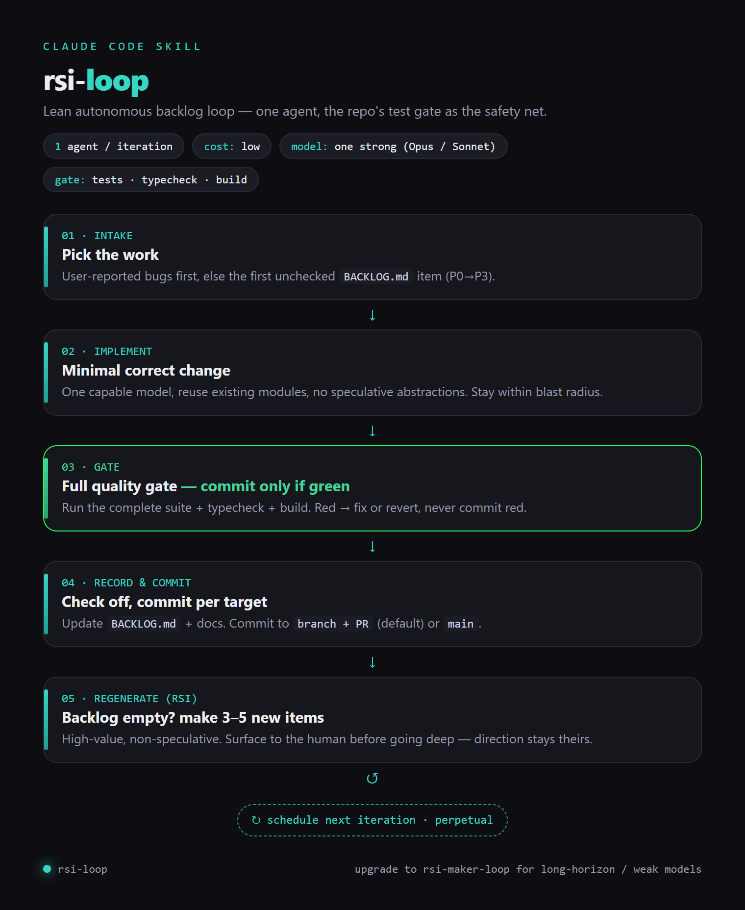
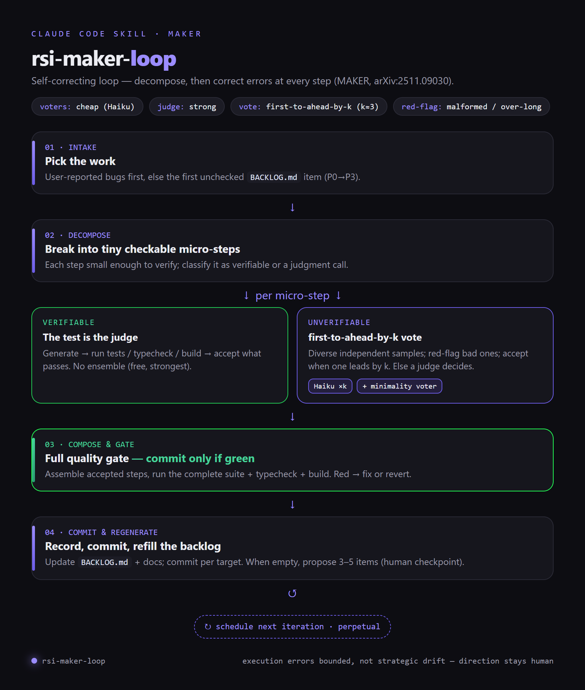

<div align="center">

# rsi-loops

**Autonomous, backlog-driven development loops for [Claude Code](https://docs.anthropic.com/en/docs/claude-code).**

Two skills, one idea: turn a `BACKLOG.md` into shipped, verified changes — one item at a time — and run indefinitely. Pick the cheap loop or the self-correcting one.

[](LICENSE)


[](https://arxiv.org/abs/2511.09030)

</div>

---

## The two loops

| | [`rsi-loop`](rsi-loop/) | [`rsi-maker-loop`](rsi-maker-loop/) |
|---|---|---|
| **What** | Lean loop: one agent per iteration | Self-correcting loop (MAKER) |
| **Error correction** | the repo's test/typecheck/build gate | **+ per-step** decomposition & voting |
| **Cost** | low (single model) | higher (voting ensemble) |
| **Best for** | clear, checkable work with a strong model | long-horizon / weak models / uncheckable, high-consequence steps |
| **Default model** | a strong model (Opus / Sonnet) | cheap voters (Haiku) + a strong judge |

Both are driven by the same `BACKLOG.md`, regenerate it when empty, gate every
commit on a green test suite, and can self-schedule to run perpetually.

**Start with `rsi-loop`.** Reach for `rsi-maker-loop` when reliability across many
dependent steps matters more than a single quick change.

## Workflow

<table>
<tr>
<td align="center"><b><code>rsi-loop</code></b> — lean</td>
<td align="center"><b><code>rsi-maker-loop</code></b> — MAKER</td>
</tr>
<tr>
<td valign="top"></td>
<td valign="top"></td>
</tr>
</table>

## Why

Autonomous coding loops fail over long horizons because errors **accumulate** —
each single-agent step has a real error rate, and a few hundred steps in, the
process derails. A bigger model only moves the cliff.

- **`rsi-loop`** keeps it cheap and simple: a capable model advances the backlog,
  the repo's own gate is the safety net.
- **`rsi-maker-loop`** adds **MAKER** ([*Solving a Million-Step LLM Task with Zero
  Errors*](https://arxiv.org/abs/2511.09030)): decompose work into tiny checkable
  micro-steps and apply error correction at **every** step — verifiable steps are
  judged by your tests; unverifiable ones by **first-to-ahead-by-k** voting across
  independent (deliberately diverse) agents, with malformed/over-long candidates
  red-flagged and resampled.

The software twist that keeps MAKER affordable: your **tests/typecheck/build are
the strongest, free "voter."** Multi-agent voting is reserved for the steps a
machine can't check.

## The economics (why cheap voters win)

MAKER's finding — and a small in-repo benchmark — both point the same way: with
decomposition + voting, **cheap models match expensive ones at a fraction of the
cost.**

| Setup | Correctness | Relative cost |
|---|---|---|
| `rsi-loop` + Opus (single shot) | 100% | high (Opus tokens) |
| `rsi-maker-loop` + Haiku (decompose + verify) | 100% | ~an order of magnitude lower |

On *easy* tasks both hit 100% (so MAKER ties, not beats — at much lower cost);
MAKER's quality edge widens on *harder / long-horizon* work where a single shot
starts to fail. Route models by role: **cheap voters, strong judge.**

## Install

Each skill is a folder. Copy the one(s) you want into your Claude Code skills
directory so that `SKILL.md` sits at `…/skills/<name>/SKILL.md`:

```bash
git clone https://github.com/SandroHub013/rsi-maker-loop /tmp/rsi-loops
cp -r /tmp/rsi-loops/rsi-loop        ~/.claude/skills/rsi-loop
cp -r /tmp/rsi-loops/rsi-maker-loop  ~/.claude/skills/rsi-maker-loop
```

Then ask in natural language — "start the RSI loop on this repo", "run an
autonomous MAKER loop", "keep working through my backlog".

## Configure

Optional per-repo config (`.rsi-loop.json` / `.rsi-maker-loop.json`):

```json
{ "commit_target": "branch-pr", "perpetual": true, "vote_k": 3, "max_blast_radius": "small" }
```

`commit_target`: `"branch-pr"` (open PRs — recommended) or `"main"`. `vote_k`
(maker only): independent candidates per unverifiable step.

## Honest boundaries

- **Execution, not direction.** These loops bound *execution* errors, not whether
  the work is the *right* work. They pause for a human checkpoint when regenerating
  the backlog; user bugs/requests always take priority.
- **`rsi-loop` has only the gate** as a safety net — a mistake the tests miss can
  land; prefer `branch-pr`.
- **Voting needs independent voters** — same model + same prompt = same blind spot;
  diversify framings/models, and always keep a *minimality* voter to fight bloat.
- **Decomposition has limits** — great for long, mechanical, checkable work; weak
  for novel architecture that needs holistic design.

## Layout

```
.
├─ rsi-loop/            # lean loop
│  ├─ SKILL.md
│  └─ references/backlog.md
├─ rsi-maker-loop/      # MAKER self-correcting loop
│  ├─ SKILL.md
│  └─ references/{voting.md, backlog.md}
├─ README.md
└─ LICENSE
```

## Credits

Error-correction approach inspired by **MAKER** (Meyerson et al.,
[arXiv:2511.09030](https://arxiv.org/abs/2511.09030)) — *massively decomposed
agentic processes* ("first-to-ahead-by-k" voting, maximal decomposition,
red-flagging). This project adapts it to everyday software by using the repo's own
test/type/build gates as the primary per-step verifier.

## License

[MIT](LICENSE).
